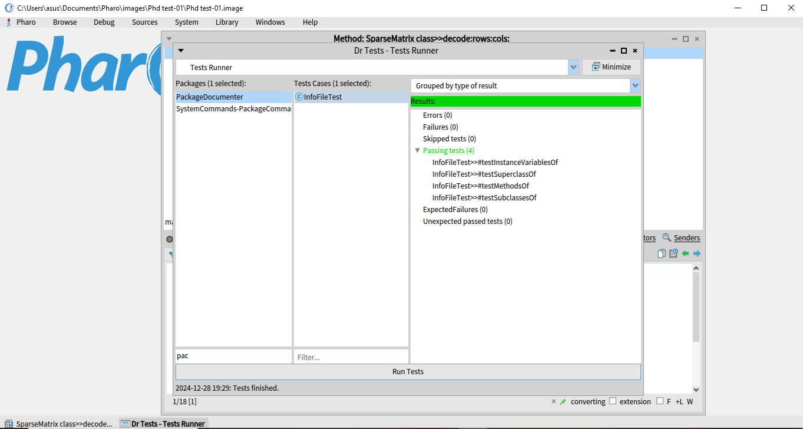

## Part1: 

Goal: Create a program that converts a traditional matrix representation (2D array) into a sparse matrix representation and vice versa. 

This solution adopts the representation of the sparse matrix using **arrays**, as outlined in [GeeksforGeeks](https://www.geeksforgeeks.org/sparse-matrix-representation):

1. **Row:** Index of the row where the non-zero element is located.
2. **Column:** Index of the column where the non-zero element is located.
3. **Value:** Value of the non-zero element at the given row and column.

---

### Solution Implementation

#### Class: `SparseMatrix`
This class provides two main methods:
1. **`encode:`** Converts a traditional matrix (2D array) to a sparse matrix representation using a dictionary.
2. **`decode:size:`** Converts a sparse matrix representation back to a traditional matrix.

##### SparseMatrix Class Code
```smalltalk
Object subclass: #SparseMatrix
    instanceVariableNames: ''
    classVariableNames: ''
    poolDictionaries: ''
    category: 'MatrixOperations'.

SparseMatrix >> encode: matrix
    | sparseDictionary |
    sparseDictionary := Dictionary new.
    1 to: matrix size do: [ :i |
        1 to: (matrix at: i) size do: [ :j |
            | value |
            value := (matrix at: i) at: j.
            value ~= 0 ifTrue: [
                sparseDictionary at: (i -> j) put: value.
            ].
        ].
    ].
    ^ sparseDictionary.

SparseMatrix >> decode: sparseDictionary size: matrixSize
    | matrix |
    matrix := Array new: matrixSize withAll: [Array new: matrixSize withAll: 0].
    sparseDictionary keysAndValuesDo: [ :key :value |
        | row col |
        row := key key. "Extract the row index from the key"
        col := key value. "Extract the column index from the key"
        (matrix at: row) at: col put: value. "Set the value in the matrix"
    ].
    ^ matrix.
```

#### SparseMatrixTest class
This class verify both encoding and decoding functionality for the sparse matrix operations.

```smalltalk
TestCase subclass: #SparseMatrixTest
    instanceVariableNames: ''
    classVariableNames: ''
    poolDictionaries: ''
    category: 'MatrixOperationsTests'.

"Test encoding of a traditional matrix to a sparse matrix representation"
SparseMatrixTest >> testEncoding
    | matrix sparseMatrix |
    matrix := #(#(0 0 3 0) #(0 0 0 0) #(0 1 0 0)).
    sparseMatrix := SparseMatrix encode: matrix.
    self assert: (sparseMatrix at: (1 -> 3)) equals: 3.
    self assert: (sparseMatrix at: (3 -> 2)) equals: 1.
    self assert: sparseMatrix size equals: 2.

"Test decoding of a sparse matrix back to a traditional matrix format"
SparseMatrixTest >> testDecoding
    | sparseMatrix decodedMatrix expectedMatrix sparseMatrixInstance |

    sparseMatrix := Dictionary new.
    sparseMatrix at: (1 -> 1) put: 1.
    sparseMatrix at: (2 -> 2) put: 2.

    expectedMatrix := {
        {1. 0.}.
        {0. 2.}.
    }.
    
    sparseMatrixInstance := SparseMatrix new.
    decodedMatrix := sparseMatrixInstance decode: sparseMatrix size: 2.
    
    "Verify the decoded matrix matches the expected matrix"
    self assert: (decodedMatrix = expectedMatrix).
```
---

### Screenshot of Test Results
Below is an example screenshot of test execution:


---

### Pharo Image File
- Due to the large size of the Pharo image file, it has not been included in this repository. If required for evaluation, please let me know, and I will provide it separately.


---
## Part 2:

Goal: create a Pharo program that generates a simple documentation equivalent to JavaDoc for classes in a package. The documentation includes details about a class's superclass, subclasses, instance variables, and methods.

---

### Task Requirements
1. **Generate Documentation for a Class**: Print details of a given class, including:
    - Superclass
    - Subclasses
    - Instance variables
    - Methods
2. **Test the Code**: Create a test class to verify the functionality of the documentation methods.

---

### Implementation Outline

#### **1. InfoFile Class**
This class contains methods for retrieving and printing class information.

```smalltalk
Object subclass: #InfoFile
    instanceVariableNames: ''
    classVariableNames: ''
    poolDictionaries: ''
    category: 'PackageDocumenter'.


InfoFile class>>superclassOf: aClass
    ^ aClass superclass.

InfoFile class>>subclassesOf: aClass
    ^ aClass subclasses.

InfoFile class>>instanceVariablesOf: aClass
    ^ aClass instVarNames.

InfoFile class>>methodsOf: aClass
    ^ aClass selectors.

InfoFile class>>documentClass: aClass
    Transcript show: 'Class: ', aClass name; cr.
    Transcript show: 'Superclass: ', (self superclassOf: aClass) name; cr.
    Transcript show: 'Subclasses: ', ((self subclassesOf: aClass) collect: #name) asString; cr.
    Transcript show: 'Instance Variables: ', (self instanceVariablesOf: aClass) asString; cr.
    Transcript show: 'Methods: ', (self methodsOf: aClass) asString; cr.
```

#### **2. InfoFileTest Class**
This test class validates the functionality of the `InfoFile` methods.

```smalltalk
TestCase subclass: #InfoFileTest
    instanceVariableNames: ''
    classVariableNames: ''
    poolDictionaries: ''
    category: 'PackageDocumenterTests'.

testInstanceVariablesOf
    | info instanceVars classToTest |
    info := InfoFile new.
    classToTest := Point.
    instanceVars := info instanceVariablesOf: classToTest.
   "Assert that 'x' is an instance variable of Point"
    self assert: (instanceVars includes: 'x').
    "Assert that 'y' is an instance variable of Point"
    self assert: (instanceVars includes: 'y').

testMethodsOf
    | info methods classToTest |
    info := InfoFile new.
    classToTest := String.
    methods := info methodsOf: classToTest.
    "Assert that 'asUppercase' is a method of String"
    self assert: (methods includes: #asUppercase).
    "Assert that 'asLowercase' is a method of String"
    self assert: (methods includes: #asLowercase).

testSubclassesOf
    | info subclasses classToTest |
    info := InfoFile new.
    classToTest := Object.
    subclasses := info subclassesOf: classToTest.
    "Assert that InfoFile is a subclass of Object"
    self assert: (subclasses includes: InfoFile ).

testSuperclassOf
    | info superClass classToTest |
    info := InfoFile new.
    classToTest := InfoFile.
    superClass := info superclassOf: classToTest.
    "Assert that the superclass of InfoFile is Object"
    self assert: superClass = Object.


```

---

### Screenshot of Test Results
Below is an example screenshot of successful test execution:



---

### Pharo Image File
- Due to the large size of the Pharo image file, it has not been included in this repository. If required for evaluation, please let me know, and I will provide it separately.


---

### Notes
- The `Transcript` is used to print documentation details. Make sure the Transcript window is open during execution.
